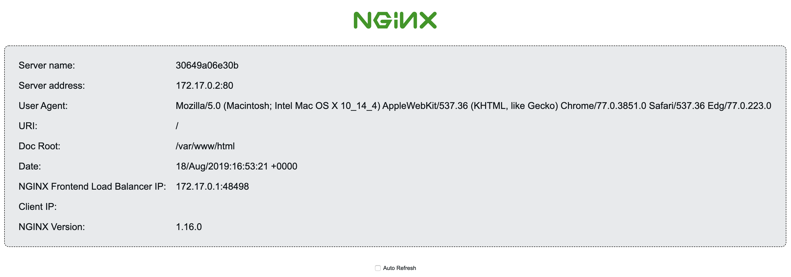

# http-hello-world

Minimal docker image to test docker deployments. [View in (dockerhub)[https://hub.docker.com/r/lmmendes/http-hello-world]]

Runs nginx on top of Alpine with a 'Hello World' page listening in port 80.

All logging messages are sent to stdout.

## Usage

    docker run -d --name hello-world -p 8080:80 lmmendes/http-hello-world

## View

Going to http://localhost:8080 [use the defined port] should see the following:

## Bug reports and other issues

* https://github.com/lmmendes/docker-http-hello-world/issues

## Help and Docs

* https://github.com/lmmendes/docker-http-hello-world/wiki

## Contributing

* Fork the project.
* Make your feature addition or bug fix.
* Add tests for it. This is important so I don't break it in a future version unintentionally.
* Send me a pull request. Bonus points for topic branches.

## License

http-hello-world is free software distributed under the terms of the MIT license reproduced [here](http://opensource.org/licenses/mit-license.html).
